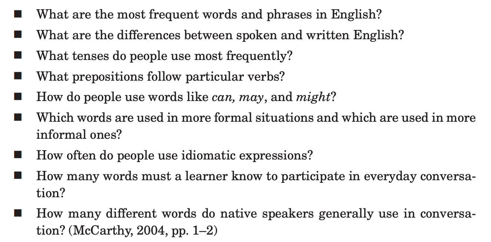
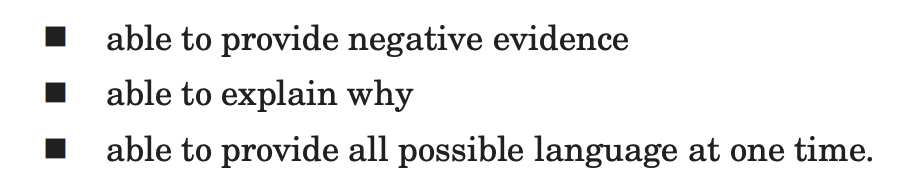
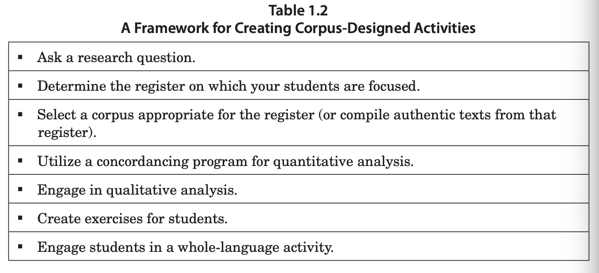
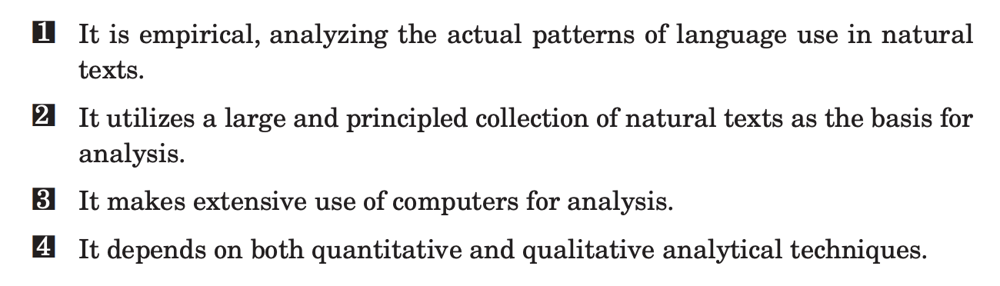

# Intro to Corpus Linguistics - notes
https://press.umich.edu/pdf/9780472033850-part1.pdf

## Types of Corpora
- Generalized, specialized, learner, pedagogic

## Creating Corpora
- Internet "alerts", a.k.a content change detection and notification service, is one interesting way to create corpora. EX: Google Alerts
- Must handle copyright and/or IRB

## **Concordancing program**
- Modern equivalent: Python libraries like nltk and Spacy that analyzes language in a corpus.
- In navigating older corpora with its own concordancing programs, I noticed the user interface is often overwhelming, with little built-in guidance on how different types of users can reap its power.

## Questions we can answer with corpora

## Corpora are not

## Application of corpus linguistics to language teaching

- **Research question**: e.g. "How do you use signal words in academic speaking?" 

## Four characteristics of the corpus approach
